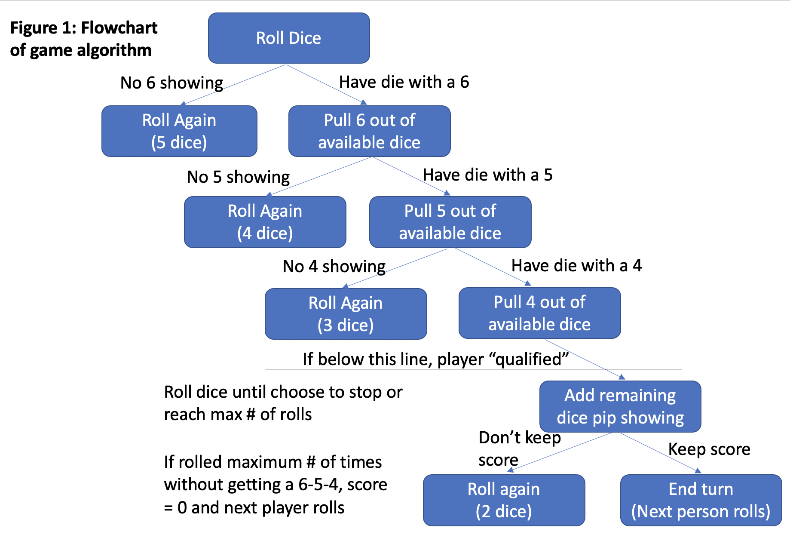

```{r setup, include=FALSE, fig.align='left'}
library(knitr)
library(tidyverse)
library(Hmisc)
opts_chunk$set(echo = FALSE, message = FALSE)
```


# Introduction and background of the 6-5-4 game

My family plays this game at family events that we call "6-5-4", which according to Google has other names like "Ship, Captain, Crew" [(1)](https://en.wikipedia.org/wiki/Ship,_captain,_and_crew). Usually, you ante a quarter or dime and everyone gathers around a table or something, and you roll dice trying to get a 6, 5, 4 in order, and add the remaining dice together to try to get the highest score (or sometimes we play high/low where you split the pot in half and the highest and lowest win). [Figure 1](654_game_algorithm.png) shows a flowchart of the game. 

```{r 654_game_algorithm, echo=FALSE, out.width = '90%'}

```

I was interested in the probability of winning in different circumstances. What is probability of "qualifying" (getting a 6-5-4)? What is the expected score given that you qualify? What is a good score for the number of players that are playing? 

# Method of simulating the distribution of outcomes

It seems that the simplest way to do this is to write a function that simulates and generalizes the flowchart in Figure 1. 

```{r, echo = TRUE}
SixFiveFour = function(numDice = 5, numSides = 6, maxRolls = 3, scoreToKeep = 13) {
  sixPresent = F
  fivePresent = F
  fourPresent = F
  score = 0
  for (i in 1:maxRolls) {
    roll_outcome = sample(1:numSides, numDice, replace = T)
    if (6 %in% roll_outcome & !sixPresent) {
      numDice = numDice - 1
      roll_outcome = roll_outcome[-which(roll_outcome == 6)[1]]
      sixPresent = T
    }
    if (5 %in% roll_outcome & sixPresent & !fivePresent) {
      numDice = numDice - 1
      roll_outcome = roll_outcome[-which(roll_outcome == 5)[1]]
      fivePresent = T
    }
    if (4 %in% roll_outcome & sixPresent & fivePresent & !fourPresent) {
      numDice = numDice - 1
      roll_outcome = roll_outcome[-which(roll_outcome == 4)[1]]
      fourPresent = T
    }
    if (fourPresent & fivePresent & sixPresent) {
      score = sum(roll_outcome)
    }
    if (score >= scoreToKeep) {
      break
    }
  }
  return(score)
}
```

The SixFiveFour function simulates the flowchart in Figure 1. When a player rolls right away, they roll numDice (5 by default) dice, each with numSides (6) sides. They get maxRolls (3) number of rolls maximum to try to get "qualified" (get a 6, 5, 4) and maximize their score. If their score matches or beats the scoreToKeep (13 by default, so if there are 5 dice and 6 sided, there is no score to keep and they will roll maxRolls times) then they will give up their chances to roll again, if they have any. Their final score is stored in a vector, either the sum of the remaining dice or 0 if they didn't qualify. 

Starting from a new player who hasn't yet rolled: 
First the numbers of the dice rolled is generated from sampling from 1 to numSides (6 by default) of the dice with replacement. The number of dice sampled is the numDice which would be 5 by default. This simulates a player rolling 5 normal cubic dice. Then, there are 5 if statements.

  -If the player has a six in the roll, they pull the 6 out and set it aside. They no longer have to get a 6 again.
  -If there is a 5 and a 6 has either been rolled or set aside, set aside the 5 as well. They no longer need to get a 6 or 5. 
  -If there is a 4, and 5 and 6 have been set aside or rolled on this turn, set aside the 4. This is the player "getting a 6-5-4" or "qualifying" to get a score. When a 4 is set aside, there will be (numDice - 3) dice left (2 by default). The sum of those is the score. 
  -The player can choose to keep that score if it is greater than or equal to their score to beat and pass their turn to the next person, or they can roll again until they have rolled maxRolls times.
  
If any of those if statements are not satisfied, all the ones below won't be either and they roll again.
When the player has rolled maxRolls times without being able to get a 6-5-4, they score a 0 and pass their turn to the next player. 

# Results

10000 simulations of the SixFiveFour function for each of scoretoKeep 6 through 12 and no score to keep to simulate the distribution of scores. Figure 2 shows the distribution of the scores for those 10,000 simulations where a 0 is the situation where the player didn't qualify, and every other score is the sum of the two remaining dice at the end. The probability of not qualifying (scoring 0) based on this simulation-based method is around 45%, independent of the rule for a score to keep. That makes sense because the rule for keeping a score takes place after a player has qualified, so it would be expected to be independent of the rest of the distribution. 

```{r}
# Create data frame of simulations
set.seed(11152020)
reps = 10000
df = tibble(NoRule = replicate(reps, SixFiveFour()), 
            Keep6 = replicate(reps, SixFiveFour(scoreToKeep = 6)),
            Keep7 = replicate(reps, SixFiveFour(scoreToKeep = 7)),
            Keep8 = replicate(reps, SixFiveFour(scoreToKeep = 8)),
            Keep9 = replicate(reps, SixFiveFour(scoreToKeep = 9)),
            Keep10 = replicate(reps, SixFiveFour(scoreToKeep = 10)),
            Keep11 = replicate(reps, SixFiveFour(scoreToKeep = 11)),
            Keep12 = replicate(reps, SixFiveFour(scoreToKeep = 12)))

# Turn data frame to aggregated, long data instead of sparse data
df2 = df %>% pivot_longer(cols = everything()) %>% 
  mutate(Keep = factor(name, levels = c("NoRule","Keep6", "Keep7", "Keep8", "Keep9", "Keep10", "Keep11", "Keep12")), 
         Score = factor(value), 
         name = NULL, 
         value = NULL) %>% 
  group_by(Score, Keep) %>% 
  tally() %>%
  mutate(Prob = n/reps)

# Remove scores of 0 and calculate conditional probabilty
df3 = df %>% pivot_longer(cols = everything()) %>% 
  mutate(Keep = factor(name, levels = c("NoRule","Keep6","Keep7", "Keep8", "Keep9", "Keep10", "Keep11", "Keep12")), 
         Score = factor(value), 
         name = NULL, 
         value = NULL) %>% 
  group_by(Score, Keep) %>% 
  tally() %>% 
  filter(Score != 0) %>%
  group_by(Keep) %>% 
  mutate(Prob = n/(sum(n)))
```

```{r}
# Faceted graphs of score distributions
ggplot(data = df2) + 
  geom_col(aes(x = Score, y = Prob), position = "dodge", col = "black", fill = "steelblue") +
  facet_wrap(facets = df2$Keep, ncol = 4) + 
  labs(x = "Score",
       y = "Proportion of each score",
       title = "Figure 2: Distribution of scores for different scores to keep",
       fill = "Score to Keep",
       caption = "For all different scores to keep, there is an equal \nand high probability of not qualifying (where Score = 0)") +
  theme_bw() + 
  theme(plot.title = element_text(hjust = 0.5))  +
  scale_x_discrete(limits = factor(c(0:12)),
                   breaks = factor(c(0,2,4,6,8,10,12)))

ggplot(data = df3) + 
  geom_col(aes(x = Score, y = Prob), position = "stack", col = "black", fill = "steelblue") +
  facet_wrap(facets = df3$Keep, ncol = 4) + 
  labs(x = "Score",
       y = "Proportion of each score",
       title = "Figure 3: Distribution of scores given that the player qualified",
       fill = "Rule for the score to keep",
       caption = "Given that a player qualifies, the effect of keeping a score \nshows that some rules are more beneficial to the player") +
  theme_bw() + 
  theme(plot.title = element_text(hjust = 0.5)) +
  scale_x_discrete(breaks = factor(c(2,4,6,8,10,12)))
```

You can see in Figure 2 and even more in Figure 3 that the distribution of scores is heavily affected by the rule for a score to keep. When there is no rule, the player would just re-roll until they hit the maximum number of rolls, which by default is 3. That's not likely to be very representative of the way an actual player would play, which leads to the rule for a score to keep. 

Figure 3 shows the distribution of scores given a player has qualified for all the different rules to keep a score. There is a spike in the probabilities of scores that are equal to or higher than the score to keep (duh, we're keeping those scores). I think the next obvious question is does this provide a benefit, and if so, by how much? Which rules would be the most beneficial to the player if they were playing? It would make sense that a rule to keep a high score would be beneficial, because if a player scores a 12, for example, they **cannot** improve their score from there, so they should definitely keep a 12 instead of throwing it away. 

```{r}
# Means and sds of these rules
df4 = df2 %>% 
  group_by(Keep) %>% 
  dplyr::summarise(Mean = wtd.mean(x = as.numeric(Score), weights = n), 
                   SD = sqrt(wtd.var(x = as.numeric(Score), weights = n)))
kable(df4, 
      col.names = c("Rule", "Mean", "SD"), 
      caption = "Mean and SD for different kept scores",
      digits = 2)

df5 = df3 %>% 
  group_by(Keep) %>% 
  dplyr::summarise(Mean = wtd.mean(x = as.numeric(Score), weights = n), 
                   SD = sqrt(wtd.var(x = as.numeric(Score), weights = n)))
kable(df5, 
      col.names = c("Rule", "Mean", "SD"), 
      caption = "Mean and SD for different kept scores given qualification", 
      digits = 2)
```

Tables 1 and 2 show the estimated means and standard deviations for different rules for kept scores. Table 1 shows the overall averages including the 45% of scores that did not qualify and were coded as a 0, and Table 2 is the conditional mean and standard deviations given the player qualified. As would be expected, if there is no rule for keeping higher scores when beneficial, the average score given qualification is nearly exactly 7, which is the mean of the sum of two dice. That makes for a starting point to consider the benefits of keeping high scores. 

In both Tables 1 and 2, the rule that has the highest mean is keeping scores that are greater than or equal to 8. That strikes a balance between keeping scores that are high but not throwing away too many "unlikely high" scores that have a reasonable chance of winning. If you're looking to maximize your score on average (which is not necessarily the point of the game), then keeping 8 or higher would give you the highest average score in the long run.

```{r}
# Given qualification, prob of scoring a number or higher
df7 = df3 %>% group_by(Keep) %>%
  dplyr::summarise(CumProb = cumsum(Prob), ProbLower = cumsum(Prob) - Prob) %>% 
  cbind(Score = rep(c(2:12), times = 8)) %>% 
  mutate(ProbHigher = 1 - CumProb)

# Prob of improving score on next roll and making score worse
ggplot(data = df7 %>% filter(Keep == "Keep9"),
       mapping = aes(x = factor(Score), group = 1)) + 
  geom_line(aes(y = ProbHigher), col = "blue") + geom_line(aes(y = ProbLower), col = "red") +
  geom_point(aes(y = ProbHigher), col = "blue") + geom_point(aes(y = ProbLower), col = "red") +
  labs(title = "Figure 4: Probability of improving (blue) and \nworsening (red) score on next roll",
       x = "Score",
       y = "Probability",
       caption = "There is a high probablity of improving your score from a low score (blue) \n and a low probability of making your score worse (red) \nand the intersection point is at score of 8, indicating that is the best rule for maximizing score") + 
  theme_bw() +
  theme(plot.title = element_text(hjust = 0.5))
```
Figure 4 shows the probability of improving your score for each possible score and the probability of making it worse. Obviously, when scores are low there is a very high chance of improving the score and for high scores there is a really low chance of improving the score. There is a natural "tipping point" where it is now more likely that you would make a score worse instead of better, at a score of 8. That's why 8 is the best "rule" for keeping a score if the goal is to maximize the average score.

```{r}
df6 = df2 %>% group_by(Keep) %>%
  dplyr::summarise(CumProb = cumsum(Prob)) %>% 
  cbind(Score = rep(c(0, 2:12), times = 8)) %>% 
  mutate(ProbHigherScore = 1 - CumProb)

dd = df6 %>% 
  filter(Keep == "Keep8") %>% 
  slice(-12) %>% 
  mutate(Score = 2:12, ProbWin = CumProb) %>% 
  select(-ProbHigherScore, -CumProb)

NumOpponents = c(1, 3, 5, 7, 11)
Prob = rep(dd$ProbWin, times = length(NumOpponents))
df9 = tibble(Score = rep(c(2:12), times = length(NumOpponents)),
             NumOpponents = rep(NumOpponents, each = 11),
             Prob = Prob) %>% 
  mutate(ProbWin = Prob^NumOpponents) %>% 
  select(-Prob)

# Plot with # of players and prob of winning with a score
ggplot(data = df9, 
       mapping = aes(x = as.factor(Score), 
                     y = ProbWin, 
                     col = as.factor(NumOpponents), 
                     group = NumOpponents)) + 
  geom_line() + 
  geom_point() + 
  labs(x = "Score", 
       y = "Probability of Winning",
       col = "Number of \nOpponents",
       title = "Figure 5: Probability of winning with different numbers of opponents",
       subtitle = "Assuming that players are completely independent of each other",
       caption = "Probability of winning decreases with more players") + 
  theme_bw() + 
  theme(plot.title = element_text(hjust = 0.5), 
        plot.subtitle = element_text(hjust = 0.5))
# Assumes that the players' rolls are independent which is not true, because if I roll an 11, you wouldn't purposely keep a 9 if you were able to roll again
```

Figure 5 shows the probability of winning for different numbers of opponents for each score. As the number of opponents increases, the probability of one or more of them tying or beating you is higher, so there is a lower chance of winning. This is assuming that all players are independent of you, and all players are playing with the "maximize mean score" strategy, which is not probably going to be satisfied. 

```{r}
# Expected return for different numbers of players
ggplot(data = df9, 
       mapping = aes(x = as.factor(Score), 
                     y = (NumOpponents+1)*ProbWin - 1, 
                     col = as.factor(NumOpponents), 
                     group = NumOpponents)) + 
  geom_line() + 
  geom_point() +
  geom_abline(intercept = 0, slope = 0) +
  labs(x = "Score",
       y = "Long Run Expected Return",
       col = "Number of \nOpponents",
       title = "Figure 6: Expected return of each score per dollar gambled", 
       caption = "If you are below the black line (y = 0), \nkeeping that score with that many players loses money in the long run \nYou win nothing for second place!") +
  theme_bw() + 
  theme(plot.title = element_text(hjust = 0.5))
```

Figure 6 shows the expected return for each score per dollar gambled, centered at zero. If the expected return is 0, in the long run that score would neither win nor lose money. A positive return indicates a profit in the long run, so you should strive to be at scores that expect a profit for the number of players in the game. 

If there are only two players (you and an opponent), a score of 4 or higher would expect a profit since the the probability of not qualifying is so high. In that situation, if you had a score of 4 and one roll left, I would still recommend still rolling again since your chance of increasing your score is so high. If you happen to make your score worse (with probability only 3/36), you still have a strong chance of winning, but if you make your score better (with probability 30/36) you get even more expected value.

If there are 12 players, a score of 4 is terrible and has basically zero chance of winning. In that situation, you should roll until you have 10 or higher, since the low probability of improving on a reasonable score of 9 (less than 25%) is balanced out by the higher amount of money you would win. The probability of winning with a 9 with 12 players is less than 10%, but jumps to nearly 25% with a 10. 

If I were playing and gambling my own money, I would follow the "keep 8 or higher" rule if there are 6 or fewer players, otherwise I would keep anything that has positive expected value when there are more than 6 players. 

# Conclusions

In conclusion, there are some really interesting and promising results, but there are major limitations to the scope of the simulation results, as mentioned earlier. 

The simulation strategy is not perfect because the only objective is to win, not to get the highest score. If you're going first, then you want to set a score that is as high as possible, but if you're going last, you know the score to beat so you're only trying to beat that. If the score to beat is 11, and you get 65455 on the first roll (so you have a score of 10, with 2 rolls to go), you have a strong score but that doesn't matter since there's no money for second place. Using the "keep 8 or higher" rule, you would keep a 10 and lose, but in real life you would roll until you can get a 11 or higher in that situation and either get first (or tied for first) or somewhere that is not first place, where you get the same amount of money for second through last place. 

Another place this model fails is with ties. In my experience there are three common ways to handle ties: *One-tie-all-tie*, everyone antes again and you start over from scratch with a pot that is twice the size, a *roll-off* where the tied parties will roll again until there is a winner , or a distant third *Split-the-pot* where the tied parties split the pot evenly. These situations are too complicated for the scope of this project, but could be included in some future work, along with improving the simulation method for handling the strategy for the game. I think this is a close approximation for now, but this could be revisited in the future. 

Future work could include solving portions of these exactly or generalizing them for the distribution of p points on n dice with s sides. It's unclear exactly how to do that because this source [(2)](https://mathworld.wolfram.com/Dice.html) suggests that there is no closed form distribution for the sum of n dice with s sides with p points. As the number of dice increases, the sum of the points showing on the dice would get closer to a normal distribution thanks to the Central Limit Theorem which would help alleviate that problem if there were many dice being summed together, but at that point it's not nearly as fun to play in real life, since a lot of time would be spent adding the sum of the dice together. That's part of the fun of the game, that basically anyone who can count is able to play and it's a big family bonding experience. 

Other future work could include investigating how changing the rules of the game, like adding dice, changing the number of rolls, or using dice with a different number of sides (see [(3)](https://www.jstor.org/stable/2324089?seq=3#metadata_info_tab_contents) for more information about fair dice that could be realistic candidates). There could be variations of the game that dont use all the same type of of dice, which would be pretty interesting. Consider a game with one of each of a 4, 6, 10, 12, and 20 sided dice, where the goal is still to get 6-5-4 and a score that is the sum of points on the remaining two dice. There would be decision making about if you should take a 6 that you roll on a 20 sided die, or if you should re-roll to try to get a 6 on the 10 or 12 sided die with the anticipation that you would get a higher score by using the biggest dice to sum together for your score. Trying to create a game like that could be pretty interesting. 

# References

Sites: 

1) [https://en.wikipedia.org/wiki/Ship,_captain,_and_crew](https://en.wikipedia.org/wiki/Ship,_captain,_and_crew)

2) [https://mathworld.wolfram.com/Dice.html](https://mathworld.wolfram.com/Dice.html)

3) [https://www.jstor.org/stable/2324089?seq=3#metadata_info_tab_contents](https://www.jstor.org/stable/2324089?seq=3#metadata_info_tab_contents)

R packages: 

Yihui Xie (2020). knitr: A General-Purpose Package for Dynamic
  Report Generation in R. R package version 1.30.

Yihui Xie (2015) Dynamic Documents with R and knitr. 2nd edition.
  Chapman and Hall/CRC. ISBN 978-1498716963

Yihui Xie (2014) knitr: A Comprehensive Tool for Reproducible
  Research in R. In Victoria Stodden, Friedrich Leisch and Roger D.
  Peng, editors, Implementing Reproducible Computational Research.
  Chapman and Hall/CRC. ISBN 978-1466561595

Wickham et al., (2019). Welcome to the tidyverse. Journal of Open
  Source Software, 4(43), 1686, https://doi.org/10.21105/joss.01686
  
Frank E Harrell Jr, with contributions from Charles Dupont and many
  others. (2020). Hmisc: Harrell Miscellaneous. R package version
  4.4-1. https://CRAN.R-project.org/package=Hmisc
  
# Appendix: R code to recreate this document
```{r, echo = T, eval = F}
library(knitr)
library(tidyverse)
library(Hmisc)
opts_chunk$set(echo = FALSE, message = FALSE)


SixFiveFour = function(numDice = 5, numSides = 6, maxRolls = 3, scoreToKeep = 13) {
  sixPresent = F
  fivePresent = F
  fourPresent = F
  score = 0
  for (i in 1:maxRolls) {
    roll_outcome = sample(1:numSides, numDice, replace = T)
    if (6 %in% roll_outcome & !sixPresent) {
      numDice = numDice - 1
      roll_outcome = roll_outcome[-which(roll_outcome == 6)[1]]
      sixPresent = T
    }
    if (5 %in% roll_outcome & sixPresent & !fivePresent) {
      numDice = numDice - 1
      roll_outcome = roll_outcome[-which(roll_outcome == 5)[1]]
      fivePresent = T
    }
    if (4 %in% roll_outcome & sixPresent & fivePresent & !fourPresent) {
      numDice = numDice - 1
      roll_outcome = roll_outcome[-which(roll_outcome == 4)[1]]
      fourPresent = T
    }
    if (fourPresent & fivePresent & sixPresent) {
      score = sum(roll_outcome)
    }
    if (score >= scoreToKeep) {
      break
    }
  }
  return(score)
}


# Create data frame of simulations
set.seed(11152020)
reps = 10000
df = tibble(NoRule = replicate(reps, SixFiveFour()), 
            Keep6 = replicate(reps, SixFiveFour(scoreToKeep = 6)),
            Keep7 = replicate(reps, SixFiveFour(scoreToKeep = 7)),
            Keep8 = replicate(reps, SixFiveFour(scoreToKeep = 8)),
            Keep9 = replicate(reps, SixFiveFour(scoreToKeep = 9)),
            Keep10 = replicate(reps, SixFiveFour(scoreToKeep = 10)),
            Keep11 = replicate(reps, SixFiveFour(scoreToKeep = 11)),
            Keep12 = replicate(reps, SixFiveFour(scoreToKeep = 12)))

# Turn data frame to aggregated, long data instead of sparse data
df2 = df %>% pivot_longer(cols = everything()) %>% 
  mutate(Keep = factor(name, levels = c("NoRule","Keep6", "Keep7", "Keep8", "Keep9", "Keep10", "Keep11", "Keep12")), 
         Score = factor(value), 
         name = NULL, 
         value = NULL) %>% 
  group_by(Score, Keep) %>% 
  tally() %>%
  mutate(Prob = n/reps)

# Remove scores of 0 and calculate conditional probabilty
df3 = df %>% pivot_longer(cols = everything()) %>% 
  mutate(Keep = factor(name, levels = c("NoRule","Keep6","Keep7", "Keep8", "Keep9", "Keep10", "Keep11", "Keep12")), 
         Score = factor(value), 
         name = NULL, 
         value = NULL) %>% 
  group_by(Score, Keep) %>% 
  tally() %>% 
  filter(Score != 0) %>%
  group_by(Keep) %>% 
  mutate(Prob = n/(sum(n)))

# Faceted graphs of score distributions
ggplot(data = df2) + 
  geom_col(aes(x = Score, y = Prob), position = "dodge", col = "black", fill = "steelblue") +
  facet_wrap(facets = df2$Keep, ncol = 4) + 
  labs(x = "Score",
       y = "Proportion of each score",
       title = "Figure 2: Distribution of scores for different scores to keep",
       fill = "Score to Keep",
       caption = "For all different scores to keep, there is an equal \nand high probability of not qualifying (where Score = 0)") +
  theme_bw() + 
  theme(plot.title = element_text(hjust = 0.5))  +
  scale_x_discrete(limits = factor(c(0:12)),
                   breaks = factor(c(0,2,4,6,8,10,12)))

ggplot(data = df3) + 
  geom_col(aes(x = Score, y = Prob), position = "stack", col = "black", fill = "steelblue") +
  facet_wrap(facets = df3$Keep, ncol = 4) + 
  labs(x = "Score",
       y = "Proportion of each score",
       title = "Figure 3: Distribution of scores given that the player qualified",
       fill = "Rule for the score to keep",
       caption = "Given that a player qualifies, the effect of keeping a score \nshows that some rules are more beneficial to the player") +
  theme_bw() + 
  theme(plot.title = element_text(hjust = 0.5)) +
  scale_x_discrete(breaks = factor(c(2,4,6,8,10,12)))


# Means and sds of these rules
df4 = df2 %>% 
  group_by(Keep) %>% 
  dplyr::summarise(Mean = wtd.mean(x = as.numeric(Score), weights = n), 
                   SD = sqrt(wtd.var(x = as.numeric(Score), weights = n)))
kable(df4, 
      col.names = c("Rule", "Mean", "SD"), 
      caption = "Mean and SD for different kept scores",
      digits = 2)

df5 = df3 %>% 
  group_by(Keep) %>% 
  dplyr::summarise(Mean = wtd.mean(x = as.numeric(Score), weights = n), 
                   SD = sqrt(wtd.var(x = as.numeric(Score), weights = n)))
kable(df5, 
      col.names = c("Rule", "Mean", "SD"), 
      caption = "Mean and SD for different kept scores given qualification", 
      digits = 2)


# Given qualification, prob of scoring a number or higher
df7 = df3 %>% group_by(Keep) %>%
  dplyr::summarise(CumProb = cumsum(Prob), ProbLower = cumsum(Prob) - Prob) %>% 
  cbind(Score = rep(c(2:12), times = 8)) %>% 
  mutate(ProbHigher = 1 - CumProb)

# Prob of improving score on next roll and making score worse
ggplot(data = df7 %>% filter(Keep == "Keep9"),
       mapping = aes(x = factor(Score), group = 1)) + 
  geom_line(aes(y = ProbHigher), col = "blue") + geom_line(aes(y = ProbLower), col = "red") +
  geom_point(aes(y = ProbHigher), col = "blue") + geom_point(aes(y = ProbLower), col = "red") +
  labs(title = "Figure 4: Probability of improving (blue) and \nworsening (red) score on next roll",
       x = "Score",
       y = "Probability",
       caption = "There is a high probablity of improving your score from a low score (blue) \n and a low probability of making your score worse (red) \nand the intersection point is at score of 8, indicating that is the best rule for maximizing score") + 
  theme_bw() +
  theme(plot.title = element_text(hjust = 0.5))


df6 = df2 %>% group_by(Keep) %>%
  dplyr::summarise(CumProb = cumsum(Prob)) %>% 
  cbind(Score = rep(c(0, 2:12), times = 8)) %>% 
  mutate(ProbHigherScore = 1 - CumProb)

dd = df6 %>% 
  filter(Keep == "Keep8") %>% 
  slice(-12) %>% 
  mutate(Score = 2:12, ProbWin = CumProb) %>% 
  select(-ProbHigherScore, -CumProb)

NumOpponents = c(1, 3, 5, 7, 11)
Prob = rep(dd$ProbWin, times = length(NumOpponents))
df9 = tibble(Score = rep(c(2:12), times = length(NumOpponents)),
             NumOpponents = rep(NumOpponents, each = 11),
             Prob = Prob) %>% 
  mutate(ProbWin = Prob^NumOpponents) %>% 
  select(-Prob)

# Plot with # of players and prob of winning with a score
ggplot(data = df9, 
       mapping = aes(x = as.factor(Score), 
                     y = ProbWin, 
                     col = as.factor(NumOpponents), 
                     group = NumOpponents)) + 
  geom_line() + 
  geom_point() + 
  labs(x = "Score", 
       y = "Probability of Winning",
       col = "Number of \nOpponents",
       title = "Figure 5: Probability of winning with different numbers of opponents",
       subtitle = "Assuming that players are completely independent of each other",
       caption = "Probability of winning decreases with more players") + 
  theme_bw() + 
  theme(plot.title = element_text(hjust = 0.5), 
        plot.subtitle = element_text(hjust = 0.5))
# Assumes that the players' rolls are independent which is not true, because if I roll an 11, you wouldn't purposely keep a 9 if you were able to roll again


# Expected return for different numbers of players
ggplot(data = df9, 
       mapping = aes(x = as.factor(Score), 
                     y = (NumOpponents+1)*ProbWin - 1, 
                     col = as.factor(NumOpponents), 
                     group = NumOpponents)) + 
  geom_line() + 
  geom_point() +
  geom_abline(intercept = 0, slope = 0) +
  labs(x = "Score",
       y = "Long Run Expected Return",
       col = "Number of \nOpponents",
       title = "Figure 6: Expected return of each score per dollar gambled", 
       caption = "If you are below the black line (y = 0), \nkeeping that score with that many players loses money in the long run \nYou win nothing for second place!") +
  theme_bw() + 
  theme(plot.title = element_text(hjust = 0.5))
```

